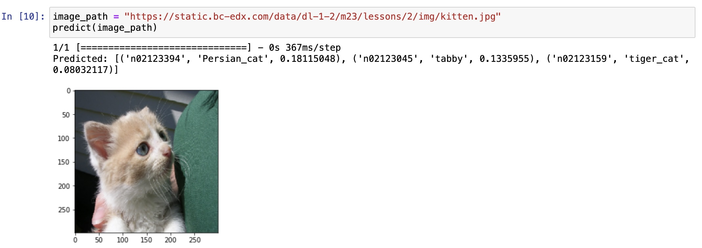

### Used the pretrained `Xception` CNN model to predict image labels by completing the following tasks:

* Visited the [Xception](https://keras.io/applications/#xception) documentation to determine the image size and any other parameters needed to load and use the model.

* Preprocessed the test image by using the model's `preprocess_input` function.

* Used the trained model to predict the output label for the [puppy image](Images/pup.jpg).

* Refactored my code into a reusable function that accepts an input image and returns a preprocessed image.

* Tested the code by preprocessing the image of a [kitten](Images/kitten.jpg) and printing the predicted labels.

  

---

© 2022 edX Boot Camps LLC. Confidential and Proprietary. All Rights Reserved.
